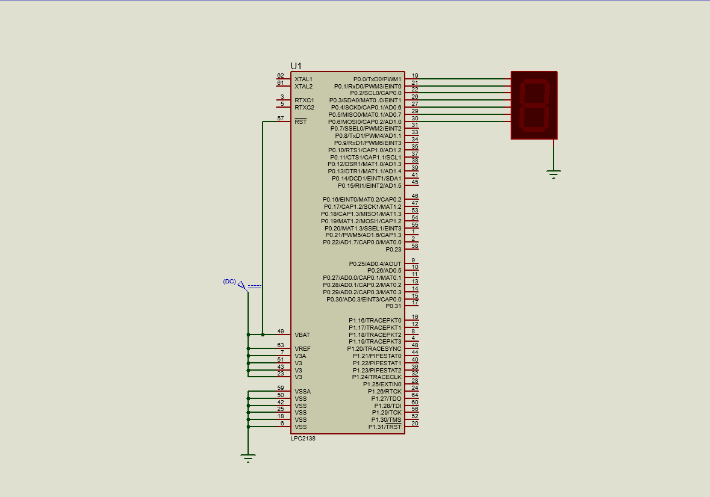

# Seven-Segment Counter Using LPC2148

This project demonstrates a **0 to 9 counter** using the LPC2148 microcontroller and a seven-segment display. The counter increments every second, displaying digits 0 through 9 on the seven-segment display.

---

## Features

- **0–9 Counting Logic**: Displays digits from `0` to `9` sequentially on the seven-segment display.  
- **Proteus Simulation**: Includes a Proteus design file for easy testing and visualization.  
- **Embedded C Programming**: Utilizes LPC2148 GPIO pins to control the seven-segment display.

---

## Components Used

### **Hardware:**
1. **LPC2148 Microcontroller**  
2. **7-Segment Display (Common Cathode)**  
3. **Power Supply (3.3V)**  

### **Software:**
1. **Proteus Design Suite** (for circuit simulation).  
2. **Keil uVision** (for ARM programming and HEX file generation).  

---

## Circuit Diagram




---

## Code Explanation

The code sends appropriate signals to the seven-segment display to light up specific segments corresponding to digits `0–9`. It uses an array of segment codes and outputs the correct pattern through GPIO pins of the LPC2148.

### Key Segment Codes
For a common cathode seven-segment display:

| Digit | `abcdefg` Code | Hex Value |
|-------|----------------|-----------|
| 0     | 1111110        | 0x3F      |
| 1     | 0110000        | 0x06      |
| 2     | 1101101        | 0x5B      |
| 3     | 1111001        | 0x4F      |
| 4     | 0110011        | 0x66      |
| 5     | 1011011        | 0x6D      |
| 6     | 1011111        | 0x7D      |
| 7     | 1110000        | 0x07      |
| 8     | 1111111        | 0x7F      |
| 9     | 1111011        | 0x6F      |

---

## Source Code

Here’s a snippet of the embedded C code used in the project. The full file is included in the repository.

```c
#include <LPC214X.H>
unsigned char test[] = {0x3f,0x06,0x5b,0x4f,0x66,0x6d,0x7d,0x07,0x7f,0x6f}	   ;
void delay()
{
	int k;
	for(k=0; k<1000000; k++);
}
void main()
{
	int j,l;
	IO0DIR = 0xff;
	while(1)
	{
		for(j=0; j<10; j++)
		{
			IO0SET =  test[j];
			delay();
			IO0CLR = 0xff;
		}
	}
}
